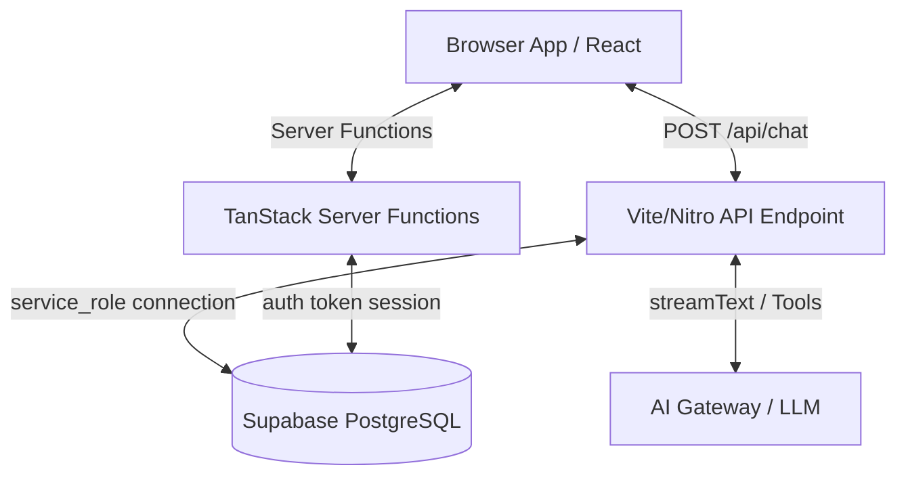

# Querium Project Flow Analysis

Querium is a full-stack, AI-powered database analytics application. It allows users to write natural language questions, which an LLM-based agent translates into read-only SQL queries, executes, visualizes (using interactive charts or diagrams), and explains with structured insights.

Here is a detailed breakdown of the project's architecture, database schema, agent controls, and UI flows.

---

## 1. Architectural Overview

Querium is built using a modern full-stack TypeScript stack:
* **Frontend Framework**: [React 19](https://react.dev) with [TanStack Start](https://tanstack.com/router/v1/docs/start/overview) (a meta-framework built on top of TanStack Router and Nitro server engine).
* **Database & Auth**: [Supabase](https://supabase.com) (PostgreSQL) for user authentication, RLS-protected workspace storage, and mock database queries.
* **AI Engine**: [Vercel AI SDK](https://sdk.vercel.ai/docs) (`streamText`) combined with an AI Gateway for streaming model completions and structured tool calling.
* **Visualizations**: [Recharts](https://recharts.org) for dynamic charting and [Mermaid.js](https://mermaid.js.org) for diagram generation.



---

## 2. Database Schema & Security Layer

The database schema (defined in [supabase/migrations](file:///c:/Users/haris/OneDrive/Desktop/Hackathons/iTech Sairam Hack/Querium/supabase/migrations)) is divided into two parts: a **demo playground** and **user workspace tables**.

### A. Demo Analytics Database (`demo` schema)
A mock dataset designed to simulate a real business. It contains four read-only tables:
1. `demo.customers`: Customer profiles (name, email, country, segment, signup date).
2. `demo.products`: Catalog items (category, price, cost).
3. `demo.orders`: Customer orders (date, status, sales channel).
4. `demo.order_items`: Order line items (link to orders & products, quantity, unit price, and generated revenue).

### B. Security Controls
The agent runs SQL queries through a secure RPC gateway instead of direct client-side DB connection. 
* **`demo_get_schema()`**: Returns tables, columns, types, and foreign key relationships in a single JSON package.
* **`demo_run_select(query_text)`**: Executed only by `service_role`. It parses, cleans, and runs the query, checking it against strict constraints:
  * Rejects statements that aren't a single `SELECT` or `WITH`.
  * Regex validation blocks mutating queries (`INSERT`, `UPDATE`, `DELETE`, etc.).
  * Restricts access to sensitive schemas/tables (`auth`, `storage`, `vault`, `threads`, `messages`, etc.).
  * Enforces a statement timeout of `10s` and limits the result to 5000 rows.

### C. Workspace Storage (`public` schema)
These tables are protected by Row Level Security (RLS) policies ensuring users can only read/write their own records:
* `public.threads`: Chat conversation records.
* `public.messages`: Text content, reasoning paths, and tool calls/outputs (stored in JSONB format matching Vercel AI SDK schemas).
* `public.query_history`: Log of every SQL query generated and executed by the agent (stores SQL string, row count, execution speed, errors, and favorite status).
* `public.dashboard_tiles`: Pinned tables/charts saved to the user's dashboard, with custom display names and ordering tags.

---

## 3. Application Routing & Flows

The routing layout is defined in [src/routes](file:///c:/Users/haris/OneDrive/Desktop/Hackathons/iTech Sairam Hack/Querium/src/routes):

```
src/routes/
├── __root.tsx              # Base page layout (Providers, Toaster, Tooltip)
├── index.tsx               # Landing page
├── auth.tsx                # Email & OAuth Google sign-in/up page
└── _authenticated/         # Layout group checking Supabase session (SSR: false)
    ├── route.tsx           # Authentication middleware check
    ├── c.index.tsx         # Redirects /c to active or new thread
    ├── c.$threadId.tsx     # Active conversation window
    ├── dashboard.tsx       # Live pinned visualizations dashboard
    └── history.tsx         # List of executed SQL logs with favoriting/re-runs
```

### Flow 1: New Session landing on `/c`
When a user accesses `/c` ([c.index.tsx](file:///c:/Users/haris/OneDrive/Desktop/Hackathons/iTech%20Sairam%20Hack/Querium/src/routes/_authenticated/c.index.tsx)):
1. It calls the `ensureThread` server function.
2. `ensureThread` checks the database for the user's most recent thread. If that thread has **zero messages**, it returns the existing blank thread (preventing thread accumulation).
3. If no empty thread is found, it creates a new thread in the database.
4. The router redirects the user to `/c/$threadId`.

### Flow 2: Running a Rerun from `/history`
When a user triggers a query re-run in [history.tsx](file:///c:/Users/haris/OneDrive/Desktop/Hackathons/iTech%20Sairam%20Hack/Querium/src/routes/_authenticated/history.tsx):
1. A new conversation thread is created.
2. The user is navigated to `/c/$threadId?q=Re-run this query... <SQL>`.
3. [c.$threadId.tsx](file:///c:/Users/haris/OneDrive/Desktop/Hackathons/iTech%20Sairam%20Hack/Querium/src/routes/_authenticated/c.$threadId.tsx) reads the `q` search parameter and passes it as `initialPrompt` to `ChatWindow`.
4. `ChatWindow` automatically triggers the chat stream, letting the agent analyze the SQL output immediately.

---

## 4. The Agent Execution Loop

The core AI engine is configured in the chat API endpoint ([src/routes/api/chat.ts](file:///c:/Users/haris/OneDrive/Desktop/Hackathons/iTech%20Sairam%20Hack/Querium/src/routes/api/chat.ts)) and tool config ([src/lib/agent/tools.server.ts](file:///c:/Users/haris/OneDrive/Desktop/Hackathons/iTech%20Sairam%20Hack/Querium/src/lib/agent/tools.server.ts)).

```mermaid
sequenceDiagram
    autonumber
    actor User
    participant UI as ChatWindow UI
    participant API as /api/chat Endpoint
    participant Agent as LLM Agent
    participant DB as Supabase DB (RPC)
    
    User->>UI: Types question + Send
    UI->>API: POST prompt message & confirmSql config
    API->>API: Persist user message to public.messages
    API->>Agent: Stream completion with tools
    
    rect rgb(30, 41, 59)
        note right of Agent: Agent loop
        Agent->>DB: get_schema()
        DB-->>Agent: JSON schema metadata
        Agent->>UI: (Optional) Request SQL approval
        UI-->>Agent: (Optional) User approves SQL query
        Agent->>DB: execute_query(sql) / generate_chart(sql)
        DB-->>Agent: Data rows & columns
        Agent->>Agent: generate_chart / generate_flowchart / explain_data
    end
    
    Agent-->>API: Stream back markdown prose & tool outputs
    API-->>UI: Steam UI updates (shimmer, chart cards)
    API->>DB: Save assistant response + SQL queries to query_history
    UI-->>User: Renders final response
```



### A. The Operating Steps
1. **Schema Check**: If it's a new conversation, the agent runs `get_schema` first.
2. **Draft & Test SQL**: Writes SQL to aggregate and answer the query. If a query fails, the agent reads the DB error message, refines the query, and retries (up to 3 times).
3. **Visualize**: If the result contains a continuous time series or categorical data, it runs `generate_chart` to configure a Recharts visualization.
4. **Diagram**: For questions about structure or flows, it outputs Mermaid syntax via `generate_flowchart`.
5. **Summarize**: Interprets the numbers into a clean `explain_data` card with key takeaways, trends, and recommended actions.
6. **Answer**: Writes a brief markdown response concluding with a recommended follow-up question.

### B. Human-in-the-Loop: SQL Confirmation
* The UI contains a **Confirm SQL** toggle (saved in `localStorage`).
* If toggled ON, the `/api/chat` router sets `needsApproval: true` on the `execute_query` tool.
* When the agent tries to run SQL, the Vercel AI stream pauses at state `approval-requested`.
* The [ChatWindow.tsx](file:///c:/Users/haris/OneDrive/Desktop/Hackathons/iTech%20Sairam%20Hack/Querium/src/components/agent/ChatWindow.tsx) renders an `ApprovalPrompt` component displaying the SQL code and a target explanation.
* When the user clicks **Run query**, it calls `addToolApprovalResponse` to resume streaming.

---

## 5. UI & Visualization Rendering

When tool outputs arrive, they are rendered dynamically by [ToolPartView.tsx](file:///c:/Users/haris/OneDrive/Desktop/Hackathons/iTech%20Sairam%20Hack/Querium/src/components/agent/ToolPartView.tsx):

1. **`execute_query` output**: Renders `QueryResultCard.tsx`.
   * Formats numbers and dates in a clean paginated grid.
   * Provides **Download CSV** options.
2. **`generate_chart` output**: Renders `ChartCard.tsx`.
   * Integrates Recharts to draw Area, Bar, Line, Pie, or Scatter graphs depending on the agent's chosen type.
   * Generates a custom hover tooltip matching the theme's colors (`--color-chart-1` etc.).
   * Includes export capabilities: **Download PNG** (uses `html-to-image`) and **Download CSV**.
   * Contains expandable drawers for the underlying SQL and the data rows.
3. **`generate_flowchart` output**: Renders `DiagramCard.tsx`.
   * Uses Mermaid.js to render complex diagram SVGs client-side.
   * Includes a **Download PNG** button.
4. **`explain_data` output**: Renders `InsightCard.tsx`.
   * Separates takeaways into headlines, bullet points, highlighted trends, and actionable recommendations.
5. **Dashboard Pinning**:
   * Charts and Query Tables render a **Pin to dashboard** button.
   * Clicking it sends a POST request to `createDashboardTile` on the server.
   * The pinned cards can then be viewed dynamically on `/dashboard` with customizable layouts.
6. **Voice Input**:
   * The input box includes a microphone button (`VoiceInputButton.tsx`).
   * It uses browser-native `SpeechRecognition` to dictate search criteria directly into the chat composer.

---

## Summary of File Roles

* [package.json](file:///c:/Users/haris/OneDrive/Desktop/Hackathons/iTech%20Sairam%20Hack/Querium/package.json): Lists dependencies (Vercel AI, TanStack Router, Recharts, Mermaid).
* [supabase/migrations/](file:///c:/Users/haris/OneDrive/Desktop/Hackathons/iTech%20Sairam%20Hack/Querium/supabase/migrations/): Configures SQL database structure, mock tables, security rules, and RPC functions.
* [src/routes/api/chat.ts](file:///c:/Users/haris/OneDrive/Desktop/Hackathons/iTech%20Sairam%20Hack/Querium/src/routes/api/chat.ts): The Nitro server endpoint facilitating token authentication and AI completion logic.
* [src/lib/agent/tools.server.ts](file:///c:/Users/haris/OneDrive/Desktop/Hackathons/iTech%20Sairam%20Hack/Querium/src/lib/agent/tools.server.ts): System prompt guidelines and schema definitions for the agent's tools.
* [src/lib/agent/db.server.ts](file:///c:/Users/haris/OneDrive/Desktop/Hackathons/iTech%20Sairam%20Hack/Querium/src/lib/agent/db.server.ts): Executes SQL secure RPC functions in Postgres, with client-side read-only filters.
* [src/components/agent/ChatWindow.tsx](file:///c:/Users/haris/OneDrive/Desktop/Hackathons/iTech%20Sairam%20Hack/Querium/src/components/agent/ChatWindow.tsx): Main conversational React state container.
* [src/components/agent/ToolPartView.tsx](file:///c:/Users/haris/OneDrive/Desktop/Hackathons/iTech%20Sairam%20Hack/Querium/src/components/agent/ToolPartView.tsx): Renders custom visual cards corresponding to tools called.
* [src/components/agent/ChartCard.tsx](file:///c:/Users/haris/OneDrive/Desktop/Hackathons/iTech%20Sairam%20Hack/Querium/src/components/agent/ChartCard.tsx): Standardized, downloadable charts wrapper using Recharts.
* [src/components/agent/DiagramCard.tsx](file:///c:/Users/haris/OneDrive/Desktop/Hackathons/iTech%20Sairam%20Hack/Querium/src/components/agent/DiagramCard.tsx): Mermaid renderer using dynamically loaded packages.
